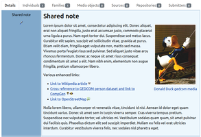
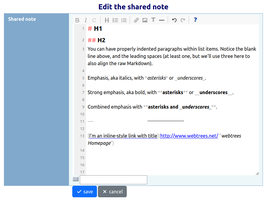

# webtrees module LinkEnhancer

[TL;DR](#tlrdr) | [Description](#description) | [webtrees](#webtrees) | [Requirements](#requirements) | [Installation](#installation) | [Contributing](#contributing) | [Translation](#translation) | [Support](#support) | [License](#license)

[](http://www.gnu.org/licenses/gpl-3.0)  


<a name="tldr"></a>
## TL;DR
**Cross-references to Gedcom datasets, Markdown editor, context-sensitive link to the GenWiki Webtrees manual**

What you can expect from the module, illustrated with screenshots:

| Screenshots | Screenshots |
| :---: | :---: |
| [](resources/img/screenshot_note-with-links-and-img.png) | [](resources/img/screenshot_sitetitle-as-link.png)<br><br>[](resources/img/screenshot_small-menu-wthb-link.png) |
| note with links and image | site title as link / small menu with help link |
| [](resources/img/screenshot_tinymde-sharednote.png) | [](resources/img/screenshot_markdown-help.png) |
| markdown editor | markdown help |


<a name="description"></a>
## Description

This module wraps up some [examples mentioned in the German Webtrees Manual](https://wiki.genealogy.net/Webtrees_Handbuch/Entwicklungsumgebung#Anpassungen_mit_dem_Modul_.22CSS_und_JS.22) and improves the application of these improvements - each component can be activated individually.

The main purpose of this module is to make **links to data records** stored in family trees more convenient. This avoids having to store fully qualified links, which impairs the portability of Gedcom data. By linking the notes to the GEDCOM data records (persons, families, sources, etc.) from the text, it is easier to replace the history module and thus also save this information in the GEDCOM file. The option of embedding the **images** already inserted in the family tree in the notes rounds off this approach. The link function is controlled via the [anchor part of the URI](https://developer.mozilla.org/en-US/docs/Learn_web_development/Howto/Web_mechanics/What_is_a_URL).

### Enhanced links
**Cross-references** are made with the XREF-ID by providing the GEDCOM record type and if necessary the tree name. It extends webtrees builtin feature, which adds record links with the standard display name by just typing `@XREF-ID@` in text or markdown.

If Webtrees provides better support for UID, referencing via UID will probably also be implemented in this module, as this will make links more fail-safe.
See also:
* Forum post [ Feature Request: Improved support for UID / _UID ](https://www.webtrees.net/index.php/forum/9-request-for-new-feature/39942-feature-request-improved-support-for-uid-uid)
* PR [UID References in notes and text #5145](https://github.com/fisharebest/webtrees/pull/5145)

This function is implemented via Javascript and only affects links in notes (with markdown enabled) and HTML blocks on the client side. The existence of the linked data records is not checked in advance. Errors only occur when the link is clicked (e. g. if the access to the ressource is restricted).


Different destinations can be addressed with one link, whereby the cross-reference is always the first link (if set) and the others are represented by attached clickable icons only. 
Included are the following **predefined external targets**:
- Wikipedia DE/EN
- Family Search Family Tree
- [GenWiki](https://wiki.genealogy.net/)
- [GOV](https://gov.genealogy.net/?lang=en)
- [Residents database - Family research in West Prussia](https://westpreussen.de/pages/forschungsergebnisse/einwohnerdatenbank/einwohner.php)
- OpenStreetMap


**Syntax:**

* **Markdown**: In general, a link looks like this `[Link display title](#@param1&paramN` so that one or more targets can be addressed at once. For cross-references in webtrees, the parameter looks like this
  * `wt=n@XREF@` - standard link to note (available record types: i=individual, f=family, s=source, r=repository, n=note, l=sharedPlace) with XREF in active tree
  * `wt=i@XREF@othertree+dia` - link to record type individual with XREF from "othertree" and also link to Interactive tree of this person
* **HTML**: The same applies to html links `<a href="#@wt=i@I1@">Link display title</a>`
  e.g. also useable in cooperation with the name badge function of the [“⚶ Vesta Classic Look & Feel” module](https://github.com/vesta-webtrees-2-custom-modules/vesta_classic_laf) in the HTML snippet field: `<a href="#@fsft=<ref/>"></a>` for linking to a record in the Family Search Family Tree.

The syntax of the external targets is listed by the markdown help function of this module. In most cases, only one key-value parameter pair needs to be specified, consisting of the short name of the desired target and the ID of the data record located there.


**Additional external targets** can be configured by providing a custom JavaScript object on the admin page of this module. Here two example entries from predefined targets to illustrate the principle:
```javascript
{
  "fsft": {
      name: 'Family Search Tree - $ID',
      url: 'https://www.familysearch.org/tree/person/details/',
      cname: 'icon-fsft'
  },
  "osm": {
      name: 'OpenStreetMap',
      url: (id, title) => { 
          let parts = id.split('/');
          let map = parts.slice(0, 3).join('/');
          let urlsearch = '';
          if (parts.length > 3 && parts[3].trim()) {
              if (parts[3].trim() === '!') {
                  urlsearch = `?mlat=${parts[1]}&mlon=${parts[2]}`;
              } else {
                  urlsearch = parts.slice(3).join('/');
              }
          }
          return {url:`https://www.openstreetmap.org/${urlsearch}#map=${map}`, title};
      },
      cname: 'icon-osm',
      help: [
          { n: I18N['osm-help1'], e: '17/53.619095/10.037395' },
      ]
  }
}
```
Explanation:
* key = is the obove mentioned short name or query parameter key
* name = title/label to be displayed as link title, placeholder $ID for inserting given id
* url = service url to be called - standard: parameter value / given record id will be appended to the end of the url; It can also be a function(id, title) provided.
* cname = CSS class name(s) whitespace separated
* help = array of objects [{n:'', e:''},..] - optional parameter examples (in e) with explanation (in n)


Any [CSS](https://en.wikipedia.org/wiki/CSS) rules required are best added via the “CSS and JS” module. Only the definition of the icon as a background image is actually needed - referencing as data: URL (see also: [mdn web docs - data: URLs](https://developer.mozilla.org/en-US/docs/Web/URI/Reference/Schemes/data)).
For example: `.icon-whatever { background-image: url(...) }`


### Markdown
Markdown is a simple system of formatting, used on websites such as Wikipedia or Github. It uses unobtrusive punctuation characters to create headings and sub-headings, bold and italic text, lists, tables, etc.

In webtrees it is optionally supported in note records.
On the subject of markdown see also: [Github webtrees Issues](https://github.com/fisharebest/webtrees/issues?q=is%3Aissue%20markdown)

#### Markdown Image Support
Images of gedcom media records reside behind the media firewall. Therefore, this function cannot be provided with JavaScript, but by extending the [MarkDownFactory class](https://github.com/fisharebest/webtrees/blob/main/app/Factories/MarkdownFactory.php).
If restriction rules apply to the record, instead of the image, a message is displayed.

The images are packed into a div container together with an image subtitle - which is also a link to the media data set for GEDCOM objects. The display can be customized as required using the standard CSS classes or per image additional CSS classes (e.g. `float-start` or `float-end` from webtrees vendor.css).

**Syntax:**
- ``
- ``
- ``


#### Markdown editor
You can also enable a visual **markdown editor** for note textareas. Under the hood the project “TinyMDE - A tiny, dependency-free embeddable HTML/JavaScript Markdown editor” is used - see also: <https://github.com/jefago/tiny-markdown-editor>

Besides syntax higlighting it ships with an icon bar for common format commands, a help popup and line numbering.

Note: Unfortunately, the on-screen keyboard does NOT work as before with the previous text input field. The selected characters end up as an intermediate step in the small text field below the Markdown editor and then must be copied manually to the desired position.


### German webtrees manual
A context sensitive link to the [german webtrees manual](https://wiki.genealogy.net/Webtrees_Handbuch) can be added by javascript to the small navigation menu (if this function is also desired in the admin backend, patch P002 would need to be applied).

The mapping of routes to help articles in the manual is stored in the database table `route_help_map`. This module comes with predefined mapping rules. Generic fallback rules are possible to be set and if nothing else applies, the link points to the startpage of the manual. It is possible to import routes registered in webtrees on demand on this module admin page. This make it easier to cover individual custom module configurations.<br>Standard webtrees routes are defined in [app/Http/Routes/WebRoutes.php](https://github.com/fisharebest/webtrees/blob/main/app/Http/Routes/WebRoutes.php).

Further more you can import and export data in csv format in order to make changes more convenient.

The table has the following headers (the headers required in a CSV file for import are marked with !):

* **id**: automatic key; not relevant
* **path** !: route path - corresponds to the path of webtres pretty urls
* **handler** !: usually corresponds to the php class name of the code that handles the request
* **method** !: web request method (GET, POST, HEAD)<br>Only GET routes are generally relevant for assignment to manual sections.
* **extras** !: php class name of access level (Fisharebest\Webtrees\Http\Middleware\Auth*)
* **category**: string value for better grouping data rows; only value 'generic' has a special meaning
* **order** !: arbitrary numerical sort key, matching data rows are sorted in ascending order; standard value is 10
- **url** !: path of the url to the webtrees manual (then it's concated with the given GenWiki base/domain url); also fully qualified url to other web ressources are possible and supported (for example to Github repo readmes or wikis of custom modules, that aren't documented in the manual yet)
- **updated_at**: timestamp of last update; this helps to identify possibly outdated data rows


### Patches
**The patches can be applied additionally — the module also works without them!**

The util subfolder contains minor patches for the webtrees core.
These are [diff-files](https://www.gnu.org/software/diffutils/) that can be easily applied or removed using shell from within the installed module folder (necessary for auto detecting webtrees sources):

```bash 
Usage: util/wt-patch.sh [-R] [FILTER]
  -R                  undo Patch (patch -R)
  FILTER              '*' for all or specific (e.g. '01')
```
Don't forget to reapply the patches after updating webtrees.

These are minor bug fixes or functional enhancements — usually in a single file — that are intended to bridge the gap until they are officially fixed/implemented in the webtrees core.

| #    | Description | applies to version |
| :--: | :----       | :---:   |
| P001 | Backlink for level 1 shared notes [#5181](https://github.com/fisharebest/webtrees/issues/5181) <br> */app/Fact.php* | 2.2.1 - |
| P002 | Enable headContent/bodyContent for this module on admin backend in order to show the context help link <br> *resources/views/layouts/administration.phtml* | 2.2.1 - |
| P003 | Record has multiple uid fields [#4828](https://github.com/fisharebest/webtrees/issues/4828) <br> *app/Services/GedcomEditService.php* | 2.2.1 - |


<a name="webtrees"></a>
## webtrees

**[webtrees](https://webtrees.net/)** is an online collaborative genealogy application.
This can be hosted on your own server by following the [Install instructions](https://webtrees.net/install/).


<a name="requirements"></a>
## Requirements

This module requires **webtrees** version 2.2.
This module has the same requirements as [webtrees#system-requirements](https://github.com/fisharebest/webtrees#system-requirements).

This module was tested with **webtrees** versions 2.2.1
and all available themes and some other custom modules.

<a name="installation"></a>
## Installation
To manually install the module, perform the following steps:

1. Download the [latest release](https://github.com/bschwede/linkenhancer/releases/latest) of the module.
2. Upload the downloaded file to your web server.
3. Unzip the package into your ``modules_v4`` directory.
4. Rename the folder to ``linkenhancer``

If everything was successful, you should see a subdirectory ``linkenhancer`` with the unpacked content in the ``modules_v4`` directory.

<a name="contributing"></a>
## Contributing

If you'd like to contribute to this module, great! You can contribute by

* Contributing code - check out the issues for things that need attention. If you have changes you want to make not listed in an issue, please create one, then you can link your pull request.
* Testing - it's all manual currently, please [create an issue](https://github.com/bschwede/linkenhancer/issues) for any bugs you find.

<a name="translation"></a>
## Translation

You can use a local editor, like [Poedit](https://poeditor.com/) or [Notepad++](https://notepad-plus-plus.org/) to make the translations and send them back to me. You can do this via a pull request (if you know how) or by e-mail.

Discussion on translating can be done by creating an [issue](https://github.com/bschwede/linkenhancer/issues).

Updated translations will be included in the next release of this module.

Beside English the following languages are available:
* German


<a name="support"></a>
## Support

* **Issues**: for any ideas you have, or when finding a bug you can raise an [issue](https://github.com/bschwede/linkenhancer/issues).

* **Forum**: general webtrees support can be found at the [webtrees forum](http://www.webtrees.net/).

<a name="license"></a>
## License

* Copyright (C) 2025 Bernd Schwendinger
* Derived from **webtrees** - Copyright 2025 webtrees development team.

This program is free software: you can redistribute it and/or modify
it under the terms of the GNU General Public License as published by
the Free Software Foundation, either version 3 of the License, or
(at your option) any later version.

This program is distributed in the hope that it will be useful,
but WITHOUT ANY WARRANTY; without even the implied warranty of
MERCHANTABILITY or FITNESS FOR A PARTICULAR PURPOSE. See the
GNU General Public License for more details.

You should have received a copy of the GNU General Public License
along with this program. If not, see <http://www.gnu.org/licenses/>.

* * *
