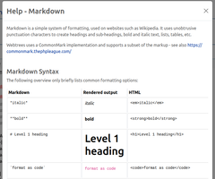
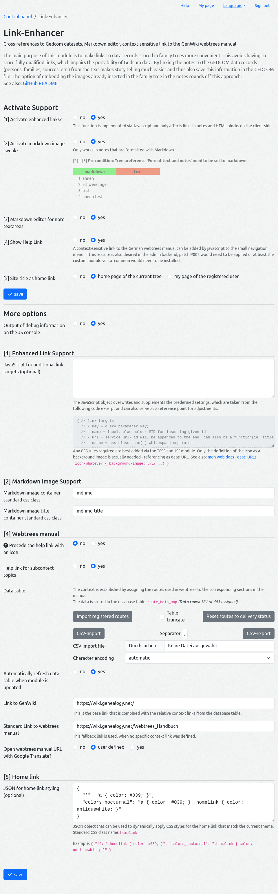
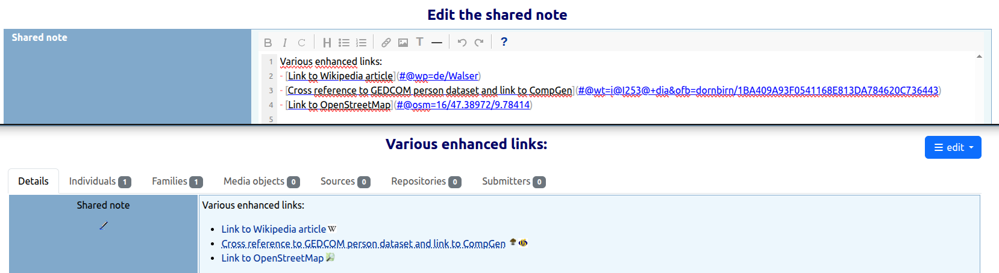

# webtrees module LinkEnhancer

[TL;DR](#tlrdr) | [Description](#description) | [webtrees](#webtrees) | [Requirements](#requirements) | [Installation](#installation) | [Contributing](#contributing) | [Translation](#translation) | [Support](#support) | [License](#license)

[](http://www.gnu.org/licenses/gpl-3.0)  


<a name="tldr"></a>
## TL;DR
**Cross-references to Gedcom datasets, Markdown editor, context-sensitive link to the GenWiki Webtrees manual**

What you can expect from the module, illustrated with screenshots:

| Screenshots | Screenshots |
| :---: | :---: |
| [](resources/img/screenshot_note-with-links-and-img.png) | [](resources/img/screenshot_sitetitle-as-link.png)<br><br>[](resources/img/screenshot_small-menu-wthb-link.png) |
| note with enhanced links and<br>image from media record | site title as home link<br>small menu with help link |
| [](resources/img/screenshot_tinymde-sharednote.png) | [](resources/img/screenshot_markdown-help.png) |
| markdown editor | markdown help |

Here the available options to be set on this modules admin page:
[](resources/img/screenshot_admin-page.png)

<a name="description"></a>
## Description

This module wraps up some [examples mentioned in the German Webtrees Manual](https://wiki.genealogy.net/Webtrees_Handbuch/Entwicklungsumgebung#Beispiel_-_Querverweise_zu_Datens.C3.A4tzen) and improves the application of these features - each component can be activated individually.

The main purpose of this module is to make [**links to data records**](#enhancedlinks) stored in family trees more convenient. This avoids having to store fully qualified links, which impairs the portability of Gedcom data. By linking the notes to the GEDCOM data records (persons, families, sources, etc.) from the text makes story telling much easier and thus also save this information in the GEDCOM file (maybe this is an alternative for the [stories module](https://wiki.genealogy.net/Webtrees_Handbuch/Anleitung_f%C3%BCr_Besucher#Geschichten)). The option of embedding the [**images**](#mdimg) already inserted in the family tree in the notes rounds off this approach. The link function is controlled via the [anchor part of the URI](https://developer.mozilla.org/en-US/docs/Learn_web_development/Howto/Web_mechanics/What_is_a_URL), so it's no problem, if this module is not active - the url just point to the current webtrees page.

Additionally there are some goodies more or less related with links:

- The note textarea can be a [**visual markdown editor**](#mde) with **markdown help**.
- A [**context sensitive help link**](#wthb) to the [german webtrees manual](https://wiki.genealogy.net/Webtrees_Handbuch) can be activated in the small menu at the top of the page.
- The [**site title can be a link**](#homelink) to the tree homepage or the user my page.
- A few minor **patches**, that can applied by bash script (not necessary for this module).

<a name="enhancedlinks"></a>
### Enhanced links
Although webtrees replaces [XREFs](https://wiki.genealogy.net/GEDCOM/XREF_ID) such as `@I2@` in notes with a **cross-reference** and it's appropriate display name, this is not so flexible. You can't determine the display name. Unfortunately, this does not work in the HTML block on the start page if you want to refer to a data record in the continuous text without inserting absolute references (such absolute references could be entered in the source code of the HTML block as follows, for example: `<a href="https://mytree.somewhere/tree/mytree/individual/I2">Jon Doe</a>`).

**Hint:** The custom module [webtrees-mitalteli-show-xref](https://github.com/elysch/webtrees-mitalteli-show-xref) can help for you find the XREF reference of personal data records.

The enhanced links function is implemented via Javascript and searches in the rendered output of webtrees for `<a>` tags whose href attribute values begin with `#@`. This way it is possible to handle links in markdown and html markup. Because it is processed in the browser on client side, the existence of the cross-referenced data records in webtrees is not checked in advance. Errors only occur when the link is clicked (e. g. if the access to the ressource is restricted).

As a bonus different destinations can be addressed with one link definition, whereby the cross-reference is always the first link (if set) and the others are represented by attached clickable icons only. 
Included are the following **predefined external targets** (the parameter keys are listed in parentheses):
- Wikipedia *(wp)*
- Family Search Family Tree *(fsft)*
- [Residents database - Family research in West Prussia](https://westpreussen.de/pages/forschungsergebnisse/einwohnerdatenbank/einwohner.php) *(ewp)*
- OpenStreetMap *(osm)*
- [Wer-wir-waren.at](https://www.wer-wir-waren.at/) (*www*) - a service of the [Vorarlberger Landesmuseumsverein](https://vlmv.at/)
- [CompGen](https://www.compgen.de/) services:
  - [GenWiki](https://wiki.genealogy.net/) *(gw)*
  - [Online Local heritage books](https://ofb.genealogy.net/?lang=en) *(ofb)*
  - [The Historic Geo Information System](https://gov.genealogy.net/?lang=en) *(gov)*
  - [GEDBAS - Genealogical Database - collected personal data](https://gedbas.genealogy.net/?lang=en) *(gedbas)*


**Syntax:**

* **Markdown**: In general, an enhanced link looks like this `[Link display title](#@param1&paramN)` so that one or more targets can be addressed at once. For cross-references in webtrees a record type and the XREF is expected, the parameter looks as follows
  - `wt=n@XREF@` - standard link to note with XREF in the current tree
    available record types:
    - i=individual
    - f=family
    - s=source
    - r=repository
    - n=note
    - l=sharedPlace
  * `wt=i@XREF@othertree+dia` - link to record type individual with XREF from tree "othertree" and also link to Interactive tree of this person
* **HTML**: The same applies to html links: `<a href="#@wt=i@I1@">Link display title</a>`
  So this is also useable in cooperation with the name badge function of the [“⚶ Vesta Classic Look & Feel” module](https://github.com/vesta-webtrees-2-custom-modules/vesta_classic_laf) in the HTML snippet field: `<a href="#@fsft=<ref/>"></a>` for linking to a record in the Family Search Family Tree.

The syntax of the external targets is listed by the markdown help function of this module. In most cases, only one key-value parameter pair needs to be specified, consisting of the short name of the desired target and the ID of the data record located there.

After a lot of theory: How does it look like in webtrees?! In the upper part of the image we can see the edit mode of a note record, below how it ist rendered in view mode:



**Additional external targets** can be configured by providing a custom JavaScript object on the admin page of this module. Here two example entries from [predefined targets](resources/js/linkenhancer.js) to illustrate the principle:
```javascript
{
  "fsft": {
      name: 'Family Search Tree - $ID',
      url: 'https://www.familysearch.org/tree/person/details/',
      cname: 'icon-fsft'
  },
  "osm": {
      name: 'OpenStreetMap',
      url: (id, title) => { 
          let parts = id.split('/');
          if (parts.length < 3) {
              title = title + ' - ' + I18N['syntax error'] + "!";
              return { url: '', title };
          }
          let map = parts.slice(0, 3).join('/');
          let urlsearch = '';
          if (parts.length > 3 && parts[3].trim()) {
              if (parts[3].trim() === '!') {
                  urlsearch = `?mlat=${parts[1]}&mlon=${parts[2]}`;
              } else {
                  urlsearch = parts.slice(3).join('/');
              }
          }
          return {url:`https://www.openstreetmap.org/${urlsearch}#map=${map}`, title};
      },
      cname: 'icon-osm',
      help: [
          { n: I18N['osm-help1'], e: '17/53.619095/10.037395' },
      ]
  }
}
```

Now some **explanation** for the used properties in the code snippet above (as a reminder, how the syntax of a base enhanced link looks like: `#@param-key=param-value`):
* *key* = is the above mentioned short name or query parameter key (param-key)
* *name* = title or label to be displayed as link title;
  standard: the placeholder `$ID` will be replaced by the given id (param-value)
* *url* = service url to be called
  standard: the parameter value / given record id (param-value) will be appended to the end of the url
  It can also be a function provided, that accepts as parameter (id, title) and returns an object `{ url, title }`. This returned title will be set instead of the name-property.
- *cname* = [CSS](https://en.wikipedia.org/wiki/CSS) class name(s) whitespace separated
* *help* = optional array of objects `[{n:'', e:''},..]` to illustrate the use of a non standard target (where the url-property is a function) by examples (in e), provided with explanatory text (in n). This information is listed in the markdown help.

`I18N` is an JavaScript object passed through from this module. 

Any CSS rules required are best added via the [“CSS and JS” module](https://wiki.genealogy.net/Webtrees_Handbuch/Anleitung_f%C3%BCr_Administratoren/Module#CSS_und_JS). Only the definition of the icon (size 30 x 30 pixels is sufficient) as a background image is actually needed - referencing as data: URL (see also: [mdn web docs - data: URLs](https://developer.mozilla.org/en-US/docs/Web/URI/Reference/Schemes/data)).
For example: `.icon-whatever { background-image: url(...) }`


**Note:** If Webtrees provides better support for UID, referencing via UID will probably also be implemented in this module, as this will make links more fail-safe.
See also:
- Forum post [Feature Request: Improved support for UID / _UID](https://www.webtrees.net/index.php/forum/9-request-for-new-feature/39942-feature-request-improved-support-for-uid-uid)
- PR [UID References in notes and text #5145](https://github.com/fisharebest/webtrees/pull/5145)

### Markdown
Markdown is a simple system of formatting, used on websites such as Wikipedia or Github. It uses unobtrusive punctuation characters to create headings and sub-headings, bold and italic text, lists, tables, etc.

Webtrees uses a CommonMark implementation and supports a subset of the markup. It is optionally supported in note records on a per tree basis.

On the subject of markdown see also:

- <https://commonmark.thephpleague.com/>
- [Github webtrees Issues](https://github.com/fisharebest/webtrees/issues?q=is%3Aissue%20markdown)
- GEDCOM-Standard: [NOTE.MIME and markdown #222](https://github.com/FamilySearch/GEDCOM/issues/222) - support in GEDCOM 7.1


<a name="mdimg"></a>
#### Markdown Image Support
This feature allows you to easily embed images from GEDCOM media records or from the public directory into notes.
If restriction rules apply to the record, instead of the image, a message is displayed.

**Syntax:**
- ``
- ``
- ``

Technically the images are packed into a div container together with an image subtitle - which is also a link to the media data set for GEDCOM objects. The display can be customized as required using the standard CSS classes or per image additional CSS classes (e.g. `float-start` or `float-end` from webtrees vendor.css).

Images of gedcom media records reside behind the media firewall. Therefore, this function cannot be provided with JavaScript, but by extending the [MarkDownFactory class](https://github.com/fisharebest/webtrees/blob/main/app/Factories/MarkdownFactory.php).


<a name="mde"></a>
#### Markdown editor
You can also enable a visual **markdown editor** for note textareas. Under the hood the project “TinyMDE - A tiny, dependency-free embeddable HTML/JavaScript Markdown editor” is used - see also: <https://github.com/jefago/tiny-markdown-editor>

Besides syntax higlighting it ships with an icon bar for common format commands, a help popup and line numbering.

**Note:** Unfortunately, the on-screen keyboard does NOT work as before with the previous text input field. The selected characters end up as an intermediate step in the small text field below the Markdown editor and then must be copied manually to the desired position.

<a name="wthb"></a>
### German webtrees manual
A context sensitive link to the [german webtrees manual](https://wiki.genealogy.net/Webtrees_Handbuch) can be added by javascript to the small navigation menu (if this feature is also desired in the admin backend, patch P002 would need to be applied or at least the custom module [vesta_common](https://github.com/vesta-webtrees-2-custom-modules/vesta_common/tree/master) would need to be installed).

The mapping of routes to help articles in the manual is stored in the database table `route_help_map`. The table has the following headers (the headers required in a CSV file for import are marked with !!):

* `id`: automatic key - not relevant, the data field is only used to make it easier to identify the data record during editing.
* `path` **!!**: route path - corresponds to the path of webtres pretty urls
* `handler` **!!**: usually corresponds to the php class name of the code that handles the request
* `method` **!!**: web request method (GET, POST, HEAD)<br>Only GET routes are generally relevant for assignment to manual sections.
* `extras` **!!**: php class name of access level (Fisharebest\Webtrees\Http\Middleware\Auth*)
* `category`: string value for better grouping data rows; only value 'generic' has a special meaning
* `order` **!!**: arbitrary numerical sort key, matching data rows are sorted in ascending order
  standard value is 10
* `url` **!!**: path of the url to the webtrees manual (then it's concated with the given GenWiki base/domain url)
  also fully qualified url to other web ressources are possible and supported (for example to Github repo readmes or wikis of custom modules, that aren't documented in the manual yet)
* `updated_at`: timestamp of last update
  this helps to identify possibly outdated data rows

As we can see in [app/Http/Routes/WebRoutes.php](https://github.com/fisharebest/webtrees/blob/main/app/Http/Routes/WebRoutes.php), where standard webtrees routes are defined, for a route the following information is mandatory:
1. `path`
2. `handler`
3. `method`

Optionally `extras` can be provided. If none of those four mentioned fields is set, the data row ist filtered by the [seeder](Schema/SeedHelpTable.php). On import `category` and `order` are set automatically if not set.

In order to get a first class match with the current route those four fields have to match.

Normally, it is only necessary to assign GET routes to an article. We also have a few redirect routes and ajax helper routes (which provide data for form controls) that can be ignored.

A special case is the `path` which starts with `/module/{module}/{action}`. It is handled by the [ModuleAction class](https://github.com/fisharebest/webtrees/blob/main/app/Http/RequestHandlers/ModuleAction.php), that has a proxy function for custom module admin pages. For mapping such a route to a specific custom module help article the `handler` is set to the routes attribut value for module (e.g. `_vesta_classic_look_and_feel_`). For a more generic rule, `path` can also be empty.

Fallback rules for access levels are matched by `category='generic'` and the specific Auth classname in `extras`.

If nothing else applies, the link points to the startpage of the manual.

On this module **admin page** it is possible to import routes registered in webtrees on demand. This make it easier to cover individual custom module configurations.
Further more you can import and export data in csv format in order to make changes more convenient. You can see at a glance how many data rows are stored in the table and how many of them have an url assigned.

In case of discrepancies the context help can be more easily adjusted by activating the option "Output of debug information on the JS console". This provides you with information on the active route and, if applicable, data table entries found for matching routing to help topics.

This module comes with predefined mapping rules. If there is something missing or you find an issue, don't hesitate to share it. I'll include it in the next release.


<a name="homelink"></a>
### Home link
Dynamic CSS styles can be applied to match the current theme, ensuring that the display contrasts well. Of course it is not limited to the home link use case.

On this module admin page you can configure a [JSON](https://en.wikipedia.org/wiki/JSON) object to achieve this: 
```javascript
{ 
  "*": ".homelink { color: #039; }",
  "colors_nocturnal": ".homelink { color: antiquewhite; }"
}
```
**Explanation:** The object key name is set to the theme name to be matched, and the string value contains one or more css style rules. In this example we have a fallback rule with key `*` that matches all themes unless there is a specific key.
Theme *colors* is a special case, where we also have palettes. In order to address this combination the key is set to `theme name_palette name`. The Key *colors* matches to all subthemes.

Just activate the option "Output of debug information on the JS console" in order to figure out the correct values.


<a name="patches"></a>
### Patches
**The patches can be applied additionally — the module also works without them!**

The util subfolder contains minor patches for the webtrees core.
These are [diff-files](https://www.gnu.org/software/diffutils/) that can be easily applied or removed using shell from within the installed module folder (necessary for auto detecting webtrees sources):

```bash 
Usage: util/wt-patch.sh [-R] [FILTER]
  -R                  undo Patch (patch -R)
  FILTER              '*' for all or specific (e.g. '01')
```
Don't forget to reapply the patches after updating webtrees.

These are minor bug fixes or functional enhancements — usually in a single file — that are intended to bridge the gap until they are officially fixed/implemented in the webtrees core.

| #    | Description | applies to version |
| :--: | :----       | :---:   |
| P001 | Backlink for level 1 shared notes [#5181](https://github.com/fisharebest/webtrees/issues/5181) <br> */app/Fact.php* | 2.2.1 - |
| P002 | Enable headContent/bodyContent for this module on admin backend in order to show the context help link <br> *resources/views/layouts/administration.phtml* | 2.2.1 - |
| P003 | Record has multiple uid fields [#4828](https://github.com/fisharebest/webtrees/issues/4828) <br> *app/Services/GedcomEditService.php* | 2.2.1 - |


<a name="webtrees"></a>
## webtrees

**[webtrees](https://webtrees.net/)** is an online collaborative genealogy application.
This can be hosted on your own server by following the [Install instructions](https://webtrees.net/install/).


<a name="requirements"></a>
## Requirements

This module requires **webtrees** version 2.2.
This module has the same requirements as [webtrees#system-requirements](https://github.com/fisharebest/webtrees#system-requirements).

This module was tested with **webtrees** versions 2.2.4
and all available themes and some other custom modules.

<a name="installation"></a>
## Installation
To manually install the module, perform the following steps:

1. Download the [latest release](https://github.com/bschwede/linkenhancer/releases/latest) of the module.
2. Upload the downloaded file to your web server.
3. Unzip the package into your ``modules_v4`` directory.
4. Rename the folder to ``linkenhancer``

If everything was successful, you should see a subdirectory ``linkenhancer`` with the unpacked content in the ``modules_v4`` directory.

<a name="contributing"></a>
## Contributing

If you'd like to contribute to this module, great! You can contribute by

* Contributing code - check out the issues for things that need attention. If you have changes you want to make not listed in an issue, please create one, then you can link your pull request.
* Testing - it's all manual currently, please [create an issue](https://github.com/bschwede/linkenhancer/issues) for any bugs you find.

<a name="translation"></a>
## Translation

You can use a local editor, like [Poedit](https://poeditor.com/) or [Notepad++](https://notepad-plus-plus.org/) to make the translations and send them back to me. You can do this via a pull request (if you know how) or by e-mail.

Discussion on translating can be done by creating an [issue](https://github.com/bschwede/linkenhancer/issues).

Updated translations will be included in the next release of this module.

Beside English the following languages are available:
* German


<a name="support"></a>
## Support

* **Issues**: for any ideas you have, or when finding a bug you can raise an [issue](https://github.com/bschwede/linkenhancer/issues).

* **Forum**: general webtrees support can be found at the [webtrees forum](http://www.webtrees.net/).

<a name="license"></a>
## License

* Copyright (C) 2025 Bernd Schwendinger
* Derived from **webtrees** - Copyright 2025 webtrees development team.

This program is free software: you can redistribute it and/or modify
it under the terms of the GNU General Public License as published by
the Free Software Foundation, either version 3 of the License, or
(at your option) any later version.

This program is distributed in the hope that it will be useful,
but WITHOUT ANY WARRANTY; without even the implied warranty of
MERCHANTABILITY or FITNESS FOR A PARTICULAR PURPOSE. See the
GNU General Public License for more details.

You should have received a copy of the GNU General Public License
along with this program. If not, see <http://www.gnu.org/licenses/>.

* * *
